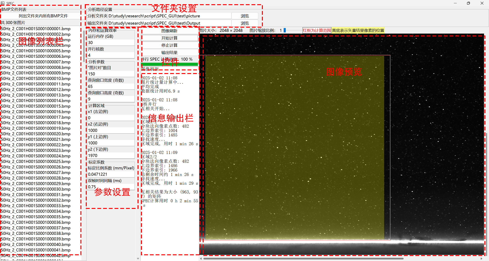
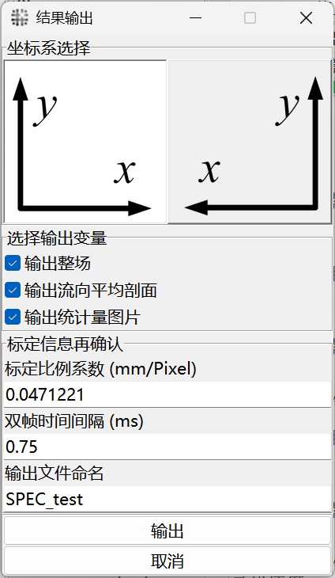
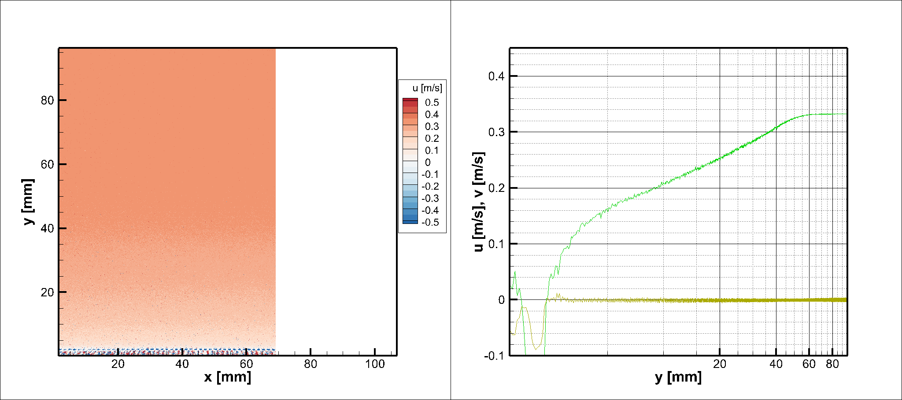
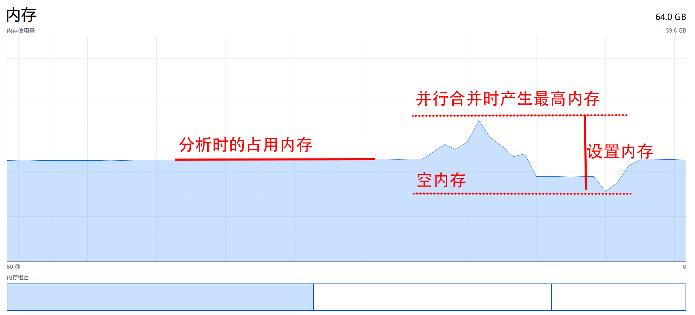
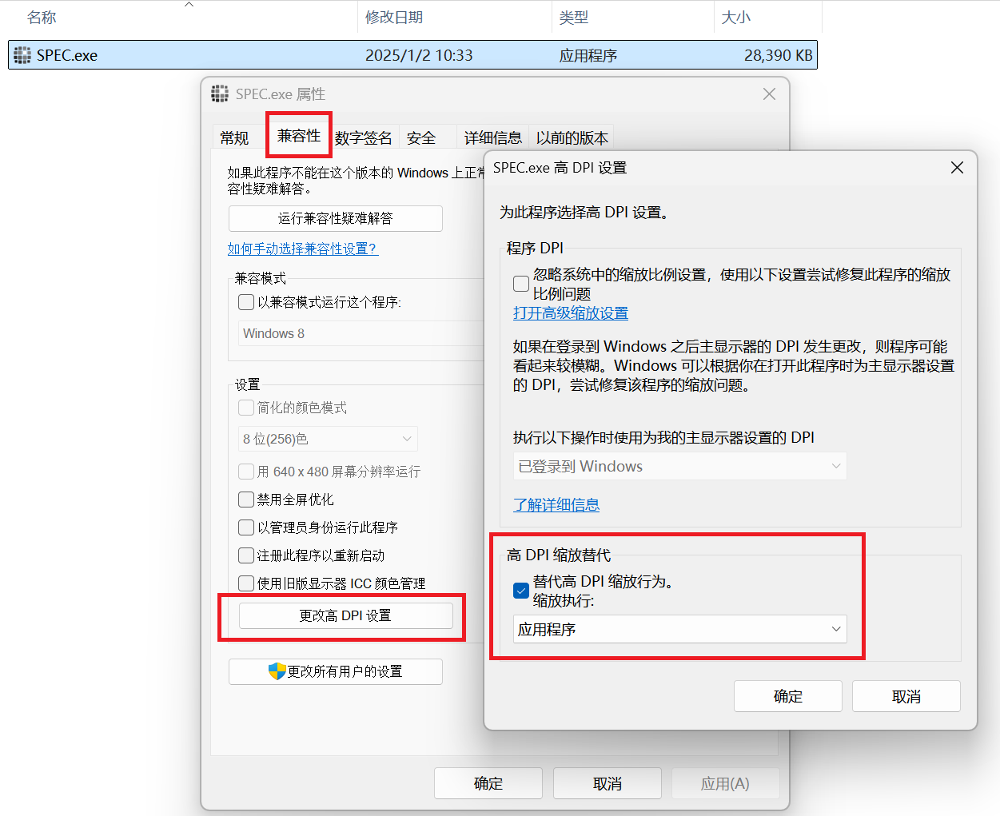

# SPEC_GUI 并行单像素互相关分析软件

## 项目简介

SPEC_GUI是一个基于Python开发的科学计算软件，专门用于流体力学实验中的速度场测量和分析。采用[**单像素互相关(SPEC)**](单像素互相关简介.md)技术，高效处理高速摄影图像序列，提取流体流动速度场信息。

> 
> 软件界面分布

## 主要功能

- **图像序列分析**: 支持BMP格式批量处理，自动图像配对
- **互相关计算**: 高效单像素互相关算法，亚像素精度
- **可视化界面**: 实时图像预览，交互式参数配置
- **结果输出**: Tecplot格式数据，多种输出选项

## 快速开始

### 系统要求

- Windows 10/11
- 多核CPU（建议4核以上）
- 内存8GB以上
- SSD存储推荐

### 安装运行

```bash
# 安装依赖
pip install numpy pillow

# 运行程序
python main.py
```

或直接运行编译好的可执行文件：`SPEC.exe`

### 打包发布

使用PyInstaller将程序打包为独立可执行文件：

```bash
# 安装PyInstaller
pip install pyinstaller

# 打包命令
pyinstaller -F -w -i icon_SPEC.ico main.py
```

**参数说明**：

- `-F`: 打包为单个exe文件
- `-w`: 运行时不显示控制台窗口
- `-i icon_SPEC.ico`: 设置程序图标

打包完成后，可执行文件位于`dist/SPEC.exe`

## 使用说明

### 软件界面


**界面包含**:

1. 分析路径设置区域
2. BMP文件列表区域
3. 参数配置区域
4. 图像预览区域
5. 控制按钮和输出栏

### 操作流程

#### 1. 设置路径

- **分析文件夹**: 存储待分析BMP图像的文件夹
- **输出文件夹**: 结果输出路径

#### 2. 列出文件

点击"列出文件夹内所有BMP文件"查看文件列表。

#### 3. 参数配置

##### 内存和运算效率

- **内存**: 并行计算内存设置，默认8GB
- **并行核数**: 进程数目，默认4核

##### 分析参数

- **"图片对"数目**: 双帧分析，最多为总数1/2
- **查询窗口**: 宽度和高度需为奇数，默认65×9

##### 计算区域

通过像素索引设置边界（索引从0开始，横向左→右增大，纵向上→下增大）

##### 标定系数

- **标定比例系数**: mm/Pixel，默认1
- **双帧时间间隔**: ms，默认1

#### 4. 刷新预览

点击"图像刷新"查看计算区域（红框为计算范围，黄色为结果区域）

#### 5. 开始计算

点击"开始计算"，监控进度条和输出信息。

#### 6. 结果输出

> 
> 输出功能选项

**输出选项**:

- **坐标系**: 左手/右手坐标系选择
- **整场输出**: 每个像素速度矢量（Tecplot格式）
- **剖面输出**: 流向平均剖面
- **统计量图片**: A/B帧平均和标准差
- **日志文件**: 自动记录分析参数

### 结果文件

| 文件类型 | 格式     | 说明                              |
| -------- | -------- | --------------------------------- |
| 场域数据 | `.dat` | Tecplot格式，包含x,y坐标和u,v速度 |
| 剖面数据 | `.dat` | Tecplot格式，流向平均速度剖面     |
| 统计图片 | `.bmp` | A/B帧平均图像和标准差图像         |
| 日志文件 | `.log` | 分析参数记录                      |

> 
> Tecplot 中导入`.dat`文件后的结果示意图

## 技术特点

### 并行计算优化

- 多核CPU并行处理

- 智能内存管理和数据分块

> 
> 计算过程中内存变化示意图

> 
> 分块运算示意图

### 算法优势

- 单像素分辨率速度测量
- 集合平均提高信噪比
- 亚像素精度位移检测

### 计算流程

1. 图像预处理和统计量计算
2. 互相关矩阵计算
3. 峰值检测和亚像素插值
4. 位移到速度转换
5. 结果后处理和输出

## 使用建议

### 性能优化

- **存储设备**: 强烈推荐使用 SSD，避免机械硬盘
- **参数设置**: 大数据集增加内存和并行核数
- **快速测试**: 减少图像对数量进行预览

### 显示效果设置

> 
> DPI缩放设置示意图

**步骤**:

1. 右键点击`SPEC.exe` → 属性
2. 兼容性 → 高DPI缩放行为
3. 设置为"应用程序"
4. 确定保存

### 杀毒软件兼容

由PyInstaller打包的软件可能被杀毒软件误报，请在杀毒软件中添加信任或白名单。

### 多任务处理

软件可多开运行，建议设置较低核数和内存数，总内存可超过物理内存。

## 常见问题

**Q: 内存不足怎么办？**  
A: 减少内存参数设置或缩小计算区域

**Q: 计算速度慢？**  
A: 增加并行核数、使用SSD、减少窗口大小

**Q: 如何导入Tecplot？**  
A: File > Import，选择生成的.dat文件

**Q: 杀毒软件报毒？**  
A: 将软件添加到信任列表或白名单

## 项目结构

```
SPEC_GUI/
├── main.py              # 主程序
├── SPEC_parallel.py     # 并行计算核心
├── icon.py              # base64 存储的图标数据
├── icon_SPEC.ico        # 应用程序主图标
├── asserts/             # 说明图片
└── ICON_DESIGN/         # 图标相关
```

## 应用场景

- 流体力学研究（边界层、湍流分析）
- 风洞实验
- 水力学研究
- 生物流体分析
- 工业应用

---

**注意**: 软件对硬盘I/O性能要求较高，建议使用高速存储设备。首次使用建议先用小数据集测试。
