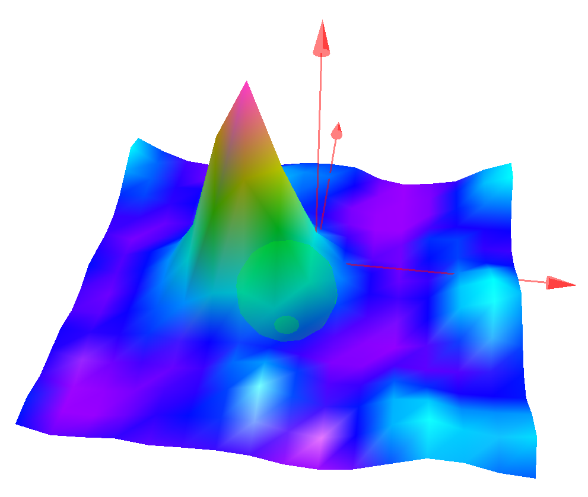
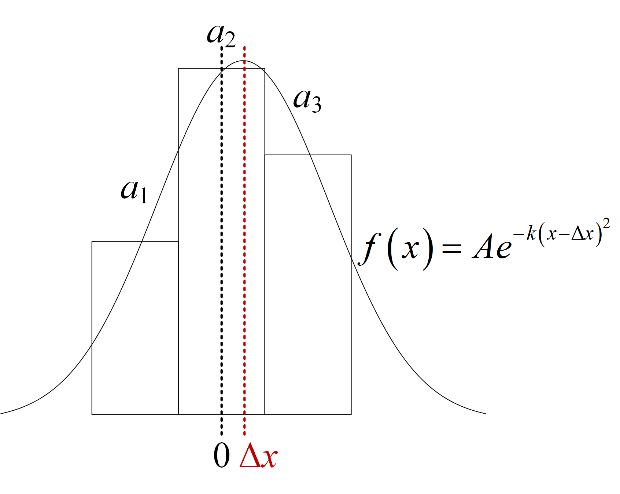
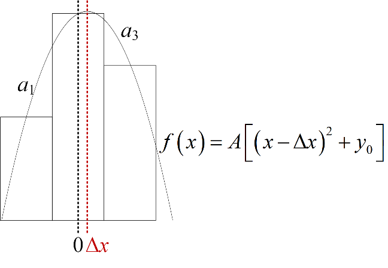

# 单像素互相关，Single-pixel Ensemble Correlation (SPEC)

## 原理

传统PIV算法为互相关算法，每两帧进行互相关后得到互相关峰值，峰值位就可以认为是查询窗口内粒子的位移。但这种方法有所限制，比如湍流边界层近壁区域反光严重，传统PIV难以计算出该区域的速度。

> 
> PIV 互相关计算示意图

单像素互相关(Kähler, et al. 2012; Shen, et al. 2014; Westerweel, et al. 2004)用于求平均速度场。其核心思想是以多个双帧瞬时图片入手，将所有AB帧进行互相关再平均得到一个平均的互相关场，然后再寻找互相关峰值。

替代先进行互相关然后进行平均的寻找互相关峰值微移位移，公式如下式：

$$
R^*(i,j,\Delta r,\Delta s)=\frac{1}{N-1}\frac{\sum_{n=1}^{N} A^n(i,j)B^n(i+\Delta r,j+\Delta s)}{\sigma(A_{i,j})\sigma(B_{i+\Delta r,j+\Delta s})}
$$

其中，$A^n$和$B^n$为去平均后的图像，$\sigma$为图像灰度值的标准差：

$$
\begin{align*}
\sigma(A) &= \frac{1}{N-1} \sum_{n=1}^{N} A^n \\
\sigma(B) &= \frac{1}{N-1} \sum_{n=1}^{N} B^n
\end{align*}
$$

得到互相关结果后，就与普通PIV算法相同，寻找互相关峰值位置即可。

## 插值以防止像素锁定

### Gauss拟合

取峰值位置的三个点，对函数$f(x)=Ae^{-k(x-\Delta x)^2}$进行拟合，如图，要求三个像素的比例与对应位置的Gauss函数的比例相同，2个方程2个位置量（$k$、$\Delta x$），消去$k$即可解出$\Delta x$。

> 
> Gauss 拟合示意图

则：

$$
a_1 : a_2 : a_3 = e^{-k(\Delta x + 1)^2} : e^{-k(\Delta x)^2} : e^{-k(\Delta x - 1)^2}
$$

$$
\ln \frac{a_1}{a_2} = -k(2\Delta x + 1), \ln \frac{a_2}{a_3} = -k(2\Delta x - 1)
$$

$$
\frac{\ln a_1 - \ln a_2}{\ln a_2 - \ln a_3} = \frac{2\Delta x + 1}{2\Delta x - 1}
$$

$$
\Delta x = \frac{1}{2} \frac{\ln a_1 - \ln a_3}{\ln a_1 - 2\ln a_2 + \ln a_3}
$$

当得到了单像素互相关$R$的峰值位置$(i,j)$时，利用如下公式计算Gauss拟合的峰值，得到亚像素峰值位置。

$$
\begin{equation}
\begin{aligned}
\Delta x &= \frac{1}{2} \frac{\ln R(i-1, j) - \ln R(i+1, j)}{\ln R(i+1, j) - 2\ln R(i, j) + \ln R(i-1, j)} \\
\Delta y &= \frac{1}{2} \frac{\ln R(i, j-1) - \ln R(i, j+1)}{\ln R(i, j+1) - 2\ln R(i, j) + \ln R(i, j-1)}
\end{aligned}
\end{equation}
$$

### 二次函数拟合（软件内使用）

取峰值位置附近的三个点，对函数$f(x) = A \left[ (x - \Delta x)^2 + y_0 \right]$进行拟合，如图，要求三个像素的比例与对应位置的Gauss函数的比例相同，2个方程2个位置量$(k,\Delta x)$，消去$k$即可解出$\Delta x$。

> 
> 二次函数拟合示意图

则：

$$
a_1 : a_2 : a_3 = (\Delta x^2 + 2\Delta x + 1 + y_0) : (\Delta x^2 + y_0) : (\Delta x^2 - 2\Delta x + 1 + y_0)
$$

$$
a_1 - a_2 = A(2\Delta x + 1), \quad a_2 - a_3 = A(2\Delta x - 1)
$$

$$
\frac{a_1 - a_2}{a_2 - a_3} = \frac{2\Delta x + 1}{2\Delta x - 1}
$$

$$
\Delta x = \frac{1}{2} \frac{a_1 - a_3}{a_1 - 2a_2 + a_3}
$$

当得到了单像素互相关$R$的峰值位置$(i,j)$时，利用如下公式计算Gauss拟合的峰值，得到亚像素峰值位置。

$$
\begin{equation}
\begin{aligned}
\Delta x &= \frac{1}{2} \frac{R(i-1, j) - R(i+1, j)}{R(i+1, j) - 2R(i, j) + R(i-1, j)} \\
\Delta y &= \frac{1}{2} \frac{R(i, j-1) - R(i, j+1)}{R(i, j+1) - 2R(i, j) + R(i, j-1)}
\end{aligned}
\end{equation}
$$

### 二次函数积分拟合

刚才的二次函数方法是让三个点的函数值插值出一个二次函数寻求最大值的$x$坐标以求得$\Delta x$，现尝试用区间积分的方法寻求一个二次函数$f(x) = A \left[ (x - \Delta x)^2 + y_0 \right]$进行拟合。

> 
> 二次函数积分拟合示意图

$$
a_1 : a_2 : a_3 = \int_{-1.5}^{-0.5} \left[ (x - \Delta x)^2 + y_0 \right] \mathrm{d}x : \int_{-0.5}^{0.5} \left[ (x - \Delta x)^2 + y_0 \right] \mathrm{d}x : \int_{0.5}^{1.5} \left[ (x - \Delta x)^2 + y_0 \right] \mathrm{d}x
$$

$$
a_1 : a_2 : a_3 = \left( \Delta x^2 + 2\Delta x + y_0 + \frac{13}{12} \right) : \left( \Delta x^2 + y_0 + \frac{1}{12} \right) : \left( \Delta x^2 - 2\Delta x + y_0 + \frac{13}{12} \right)
$$

$$
a_1 - a_2 = A(2\Delta x + 1), \quad a_2 - a_3 = A(2\Delta x - 1)
$$

$$
\frac{a_1 - a_2}{a_2 - a_3} = \frac{2\Delta x + 1}{2\Delta x - 1}
$$

$$
\Delta x = \frac{1}{2} \frac{a_1 - a_3}{a_1 - 2a_2 + a_3}
$$

与第二种方法相同。

## 总结

通过插值的方法减小相位锁定，实测表示，两个插值拟合方法的精度差别不大，但是二次函数插值不需要计算对数，其计算速度更快一点，**软件内使用二次函数插值的方法**。

## 参考文献

Kähler, C.J., Scharnowski, S. & Cierpka, C. On the resolution limit of digital particle image velocimetry. *Exp Fluids* **52**, 1629–1639 (2012). https://doi.org/10.1007/s00348-012-1280-x

Shen, J., Pan, C. & Wang, J. Accurate measurement of wall skin friction by single-pixel ensemble correlation. *Sci. China Phys. Mech. Astron.* **57**, 1352–1362 (2014). https://doi.org/10.1007/s11433-014-5462-9

Westerweel, J., Geelhoed, P.F. & Lindken, R. Single-pixel resolution ensemble correlation for micro-PIV applications. *Exp Fluids* **37**, 375–384 (2004). https://doi.org/10.1007/s00348-004-0826-y
